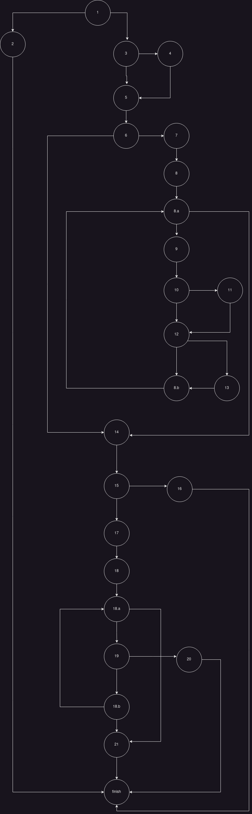

# Sebastijan Zindl 211557

# Control Graph Flow

# Cyclomatic Complexity

Using the formula E-N + 2.\
E - number of number of edges = 35\
N - number of nodes = 26\
=> 35 - 26 + 2 = 11

# Every Branch Test Case

- Test Case 1: 1-3 3-5* 4-5* 5-6* 6-7* 7-8 8-8.a 8.b-9 9-10* 10-12* 8.a-14* 12-8.b 8.b-8.a 14-15* 15-17* 17-18.a 18-18.a 18.a-19 19-20 19-18.c 18.b-18.a 20-end: 1-3 3-5* 4-5* 5-6* 6-7* 7-8 8-8.a 8.b-9 9-10* 10-12* 8.a-14* 12-8.b 8.b-8.a 14-15* 15-17* 17-18.a 18-18.a 18.a-19 19-20 19-18.c 18.b-18.a 20-finish
- Test Case 2: 15-17* 17-18 18-18.a 18.a-21 18.a-19 19-20 19-18.b 18.b-18.a 20-finish 6-14* 14-15* 5-6* 3-5\* (all the branches will be passed through)
- Test Case 3: start,1-3 3-4* 4-5* 5-6* 6-7* 7-8 8-8.a 8.a-9 9-10* 10-11* 10-12* 11-12* 8.a-14* 12-13* 12-8.b 13-8.b* 8.b-8.a 14-15* 15-17\* 17-21 21-end
- Test Case 4: 14-15* 15-16* 16-finish 8.b-8.a 12-8.b 8.a-14* 5-6* 6-7* 7-8 8-8.a 8.a-9 9-10* 10-11* 10-12* 3-5\* 1-3

With these tests all the branches will be passed through.

# Multiple conditions

- user == null returns true, which means the rest don't need to be checked. 1-2
- user == null returns false, then user.getPassword() == null is checked which with the test should return true which means the next expression won't be checked. 1-2
- user == null && user.getPassword() == null returns false, then user.getEmail() == null gets checked which with the given test case should return true, the following expressions don't need to be checked. 1-2

If all return false the condition is not completed and node 2 is skipped 1-3
